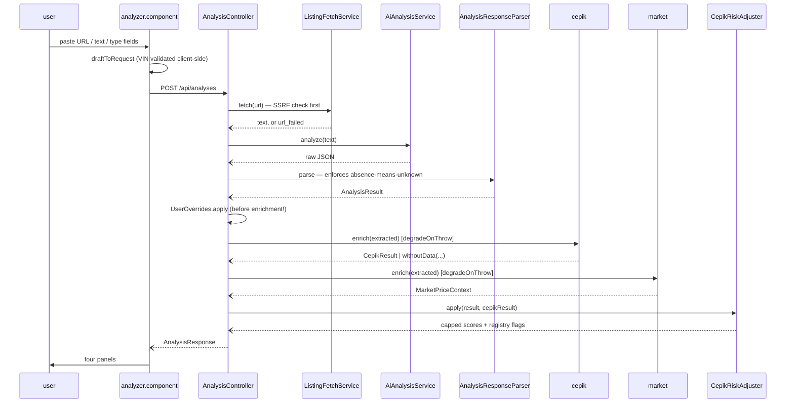

# The end-to-end analysis flow

**What this is.** A description of the *current* state of `POST /api/analyses` — the only
flow in this repo that spans both stacks. Nothing here is a plan. Produced for 10xDevs
M4-L3, from three parallel investigations (trace, coverage, blast radius), with every
structural claim then put through `ast-grep` — §7 records what survived.

**Reads on top of [`context/map/repo-map.md`](../../map/repo-map.md)** and does not repeat it.
The map says where the risk is; this says what the flow actually does inside it.

**Scope adaptation.** The lesson traces a flow "to a write and back". This repo has no
persistence, so there is no write. §5.3 reports the absence as a finding instead of skipping
the step.

---

## 1. Feature overview

A user pastes an Otomoto listing URL, or the advert text, or types vehicle fields by hand.
The backend produces one JSON document containing an LLM's structured reading of the listing,
findings from the national vehicle registry, a market-price sample, five category scores and a
verdict. The Angular app renders it as four panels. One request, ~27 s, no persistence, no
auth, no queue.

**The whole flow is synchronous on the request thread.** Two async constructs exist on the
path and neither introduces concurrency: a `CompletableFuture` used purely to put a timeout
around a blocking DNS lookup (`ListingFetchService.java:71`) and a `Thread.sleep` retry
backoff (`OpenRouterAnalysisService.java:428`). There is no executor, no `@Async`, no future
joined for parallelism, no circuit breaker, and no deadline spanning the request.

### The seven stages

| # | Stage | Where | Note |
|---|---|---|---|
| A | form → request | `analyzer.component.ts:78-132`, `vehicle-data.ts:100-123` | three input modes collapse into one `AnalysisRequest` |
| B | input triage | `AnalysisController.java:44-71` | url / url-failed / text / manual → a `fetchStatus` literal |
| C | listing fetch | `ListingFetchService` → `r.jina.ai` | SSRF pre-check *before* any fetch |
| D | LLM call + parse | `OpenRouterAnalysisService`, `AnalysisResponseParser.java:31-97` | where the business invariant is enforced |
| E | user overrides | `UserOverrides.apply` | **must** precede F |
| F | two enrichments | `AnalysisController.java:82-91` | each wrapped in `degradeOnThrow` |
| G | score adjustment | `CepikRiskAdjuster.java:70-136` | the only place two data sources meet |

### What the flow gets right

Worth stating first, because the rest of this document is about defects:

- **Failure containment is per-enrichment, not global.** `degradeOnThrow`
  (`AnalysisController.java:143-155`) means a registry outage degrades one panel instead of
  failing the request — and it is the best-tested unit on the path, with a negative control
  proving an LLM failure still returns 502.
- **The business invariant is enforced in code, not in the prompt.** `AnalysisPrompt` asks the
  model to flag an undeclared accident history; `AnalysisResponseParser.java:169-183` appends
  the flag itself if the model didn't. The guardrail does not depend on model compliance.
- **`null` vs `[]` is treated as semantic all the way onto the wire**, with two booted-context
  serialisation tests asserting the raw JSON body string.
- **The SSRF check runs before the fetch**, not after.
- **`CepikResult.withoutData(status, vin, lookupUrl)`** is the best-factored shape in the repo: a
  3-arg factory standing in front of a 21-component record at **13 call sites**, which is why
  `CepikResult` is the cheapest shape here to extend (§5.1).

---

## 2. Where the flow is dark

Three findings that share one cause: **`mock` is not a stub of the same program, it is a
different program** — and `mock` is what every local gate runs.

### 2.1 `CepikRiskAdjuster` never executes end-to-end

`MockCepikService` returns `CepikResult.withoutData(LOOKUP_FAILED, …)` unconditionally.
`CepikRiskAdjuster.java:73` early-returns unless `status == FOUND`. So under `mock` — the
default in `application.properties`, and what `playwright.config.ts` sets — **254 lines are
skipped on every request**: five score caps, five flag codes, both verdict floors, and the
negation-aware contradiction matcher.

It is not untested (`CepikRiskAdjusterTest` has 22 tests and reaches it directly), but no
end-to-end path in the repo executes it. It is the largest dark surface in the flow.

### 2.2 The one profile-only inversion of the business rule

`MockAiAnalysisService.java:147` suppresses `NO_ACCIDENT_DECLARATION` when the listing text
contains `"historia"`, while `:109-113` sets `accidentClaim` only on
bezwypadkowy/wypadek/kolizja. So *"pełna historia serwisowa"* with no accident mention yields
`accidentClaim: null` **and no accident flag** — the exact inversion the root `CLAUDE.md`
forbids. Reachable only under `mock`, and the committed E2E listing text happens to avoid it.

### 2.3 `mock` does not cover the listing fetch

`ListingFetchService` carries no `@Profile`. Under `mock`, including `npm run test:e2e`, a URL
request still performs a real DNS lookup and a real GET to `r.jina.ai`. Three integrations
are profiled; the fourth outbound call is not.

---

## 3. The REST contract, measured

The map names this the repo's #1 risk. Two things sharpen it.

### 3.1 There is no field-name drift at HEAD

14 shapes and ~87 leaf fields compared name-for-name and order-for-order between
`analysis.models.ts` and the Java records; six enum/union pairs compared constant-for-constant.
All match. **The `88d2658` drift the map describes in the present tense is closed** —
`DamageRecord.description` is nullable on both sides.

### 3.2 The risk is asymmetric, and that is the actionable fact

Neither the map nor its artifacts say which *direction* is dangerous. It is this:

| Order | What happens |
|---|---|
| **Java first** | javac drives you through every `new X(...)`. Backend suite green, frontend suite green (its fixtures still satisfy the unchanged TS type), production build green. **Panel goes blank in production.** |
| **TypeScript first** | 6 fully-typed non-`Partial` fixtures plus `strictTemplates: true` fail immediately. |

So **the correct order is TypeScript first, then Java** — the reverse of the intuitive one, and
the reverse of what `88d2658` actually did.

The reason is a coverage map no artifact had drawn: Java record arity is compiler-enforced at
every construction site, TS→template and TS→spec are compiler-enforced, and **the Java-JSON ↔
TS interface is the only uncompiled link in the entire chain.** Every intra-stack edit is loud;
precisely the cross-stack step is silent.

*Adding* a field is invisible in both directions and caught by no gate.

### 3.3 The verifier covers ~8% of the contract

`market-price-contract.spec.ts` asserts 7 fields, all inside `marketPriceContext` — ~8% of the
87. `AnalysisControllerTest` has 47 `jsonPath` assertions over ~28 distinct paths, and of
`CepikResult`'s 21 fields it covers 7. **19 of 21 `CepikResult` fields have no cross-stack
verifier at all.**

And `.githooks/pre-push` runs the backend suite, the frontend suite and the production build
but **never runs Playwright** — `test:e2e` is a manual `npm run`. The single cross-stack
verifier sits outside the last gate before production.

### 3.4 Five non-name mismatches

None is a rename; each is a latent defect no artifact had named.

1. **`fetchStatus` is a raw Java `String` against a 4-member TS union.** Produced as bare
   literals at **five** sites — `AnalysisController.java:55,66,70` and again inside the two dead
   factories at `AnalysisResponse.java:12,16` (see §6 item 10, which compounds with this). A typo
   or fifth value is caught on neither side; `analyzer.component.ts:111` branches on
   `'url_failed'` only, non-exhaustively.
2. **`ManualListing.priceCurrency` is declared in TS and never populated.** `draftToRequest`
   builds 8 of 9 fields. The backend can never receive it. Dead field, silently.
3. **`MileageStamp.date` is non-null in TS, nullable in Java.** True today only because
   `HistoriaPojazduParser.mileageFrom` guards on `date != null` before constructing one. The TS
   type depends on a runtime `if` in the parser, not on the contract.
4. **`"szkoda-istotna"` is spelled at three production sites, one of them redundant.**
   `HistoriaPojazduParser.java:41` defines it as `DAMAGE_EVENT_TYPE` and then `:61` re-spells the
   raw literal inside its own `KNOWN_EVENT_TYPES` allow-list; `cepik-result.component.html:193`
   is the third. The registry renames the event type → the backend correctly degrades to `null`,
   and the frontend's red highlight silently stops firing. A drifted-vocabulary fixture exists
   for the backend side only. The file that owns the constant does not use it.

5. **`fetchedAt` is null on `market`'s degraded paths and non-null in TS** —
   `MarketPriceFetchService.missing():154-157` and `failed():159` both pass `null` against
   `analysis.models.ts:76`'s `fetchedAt: string`. `cepik` answers the same question the other
   way: `CepikResult.withoutData` stamps `Instant.now()` at `:66`, so it is never null. Two
   packages, opposite answers, one TS type declaring both non-null. **`cepik` is right; `market`
   is the defect** — do not "fix" both.

Plus one intra-backend triplication: the three Polish verdict labels are emitted independently
at `CepikRiskAdjuster.java:247-253`, `MockAiAnalysisService.java:58-62` and
`AnalysisPrompt.java:57`. `labelFor`'s own comment names the coupling — a comment is the
enforcement mechanism.

---

## 4. Coverage of the flow

276 tests (235 backend + 41 frontend) plus 2 Playwright specs. The shape of what they cover is
more interesting than the count.

### 4.1 The business invariant: 12 enforcement points, 7½ tested

| Enforcement point | Fails if inverted? |
|---|---|
| `AnalysisResponseParser.java:169-183` — append the flag when `accidentClaim == null` | **Yes** |
| `HistoriaPojazduParser.java:87-91` — both payloads unreadable → `LOOKUP_FAILED` | **Yes** |
| `HistoriaPojazduParser.java:103,157-167` — vocabulary canary → `null`, not `[]` | **Yes** |
| `RealCepikEnrichmentService.java:130-132` — degraded results carry `null` lists | **Yes** |
| Jackson config — `null` must not become an absent key | **Yes**, booted-context test |
| `CepikRiskAdjuster.java:73,96` — act only on `FOUND`; `null` ≠ "no damage" | **Yes** |
| `analysis-result.component.html:93-95` — `accidentClaim` null → `—` | **Partly** |
| **`cepik-result.component.ts:16,48,50-54`** — `?? []` and the three-arm `damageState()` | **NO** |
| **`cepik-result.component.html:138-179`** — the "unknown" vs "none-reported" sentences | **NO** |
| **`cepik-result.component.html:246-284`** — the three degraded-status disclaimers | **NO** |
| **`cepik-result.component.html:128-133`** — `mileageStamps === null` row | **NO** |
| `AnalysisPrompt.java:16` — the instruction that asks for the flag | No test; acceptable, the parser is the enforcement |

**The asymmetry is the finding.** The backend spends five test classes and a dedicated
`@SpringBootTest` proving `null` and `[]` stay distinguishable all the way onto the wire —
`CepikResultSerialisationTest` asserts the raw body contains `"damageRecords":null` *and* does
not contain `"damageRecords":[]`. **Then nothing reads the other end of that wire.**

`cepik-result.component.ts:48` (`damages = … ?? []`) is one character from collapsing the
distinction the entire backend effort preserves, and `damageState()` at `:50-54` is the only
thing between that and the rendered sentence *"Rejestr nie zawiera zgłoszonych szkód
istotnych"* — a positive claim of a clean registry record. Invert those five lines and all 276
tests stay green while the app tells a user that a vehicle nobody could check has no reported
damage. The component's own class comment records that this **already shipped once as a bug.**

Why the suite cannot catch it: `analysis-result.component.spec.ts` does instantiate the
component, but never sets `cepikResult`, so `@if (cepikResult())` is false and every computed
stays unevaluated. Both E2E specs submit listing text with no VIN, so they only ever reach
`MISSING_INPUTS`.

`test-plan.md` §3 lists this under "Carried into Phase 3", and Phase 3 has not started. The gap
is argued and dated, not unnoticed — but the argument that deferred it was a *scheduling*
argument. Every other deferred Phase-3 item is a degradation; **this one is an inversion.**

### 4.2 Five invertible tests

Named behaviour could be deleted and the test stays green:

- **`analysis.service.spec.ts:77,90`** — the only `expect` in each lives inside the `error`
  callback, with no `expect.assertions(n)`. Add a `catchError` to `AnalysisService.analyze` and
  **zero assertions run**; `verify()` still passes because the request was flushed.
- **`analysis-result.component.spec.ts:98`** asserts `expect(link).toBeNull()` with no positive
  companion anywhere — `.expand-link` could be **deleted outright** and both related tests pass.
- **`analyzer.component.spec.ts:106`** is named "form visible" and asserts four signals that are
  just field initialisers. Structural cause: `create()` discards the fixture and returns only
  `componentInstance`, so **no test in that 14-test file makes a single DOM assertion.**
- **Three `market-price-panel` tests** assert unanchored `toEqual([])`; a broken outer `@if`
  makes them green. (`test-plan.md` §3 flags this shape; `:180` got it right by anchoring on
  `.panel-header`.)
- **`analysis-result.component.spec.ts:109`** is named "MISSING equipment item has danger tag"
  and calls `comp.equipmentSeverity('MISSING')` directly — it restates the `switch` and never
  touches the `[severity]` binding that *is* the tag.

One test is honest about being weak: `CepikRiskAdjusterTest.java:300` says in its own body
*"this test cannot tell a cap that is wrong by design from one that is right."*

### 4.3 Happy-side-only branches

`analyzer.component.ts:123` (response with no `analysis`); `analyzer.component.ts:192`
(`mapError` default); `vehicle-data.ts:89-91` (the I/O/Q VIN rejection — reached by no test at
all); `vehicle-data.ts:114-118` (`hasManual === false`); `vehicle-data.ts:67-70` (prefill must
not clobber a typed value); `AnalysisController.java:102-110` (of three seller-question
injections only *plate* is tested); the theft and no-OC cap magnitudes; `verdict-orange`;
and the whole of `cepik-result.component` — four status arms and three `damageState` arms, zero.

### 4.4 The three highest-value missing tests

| # | Test | Cost | Why |
|---|---|---|---|
| 1 | `cepik-result.component.spec.ts` — three `damageState` arms asserting the *rendered sentence*, plus the two degraded-status disclaimers | ~6 jsdom tests, ~120 lines, no HTTP, no doubles | closes the only inversion-class gap in the repo |
| 2 | the accident flag asserted **on the wire** through a real provider + `MockRestServiceServer` | 1 method, ~40 lines | today the flag is proved only by direct `parse(...)` calls; `AnalysisControllerTest` mocks `AiAnalysisService`, so the parser is not on the controller's tested path at all |
| 3 | `vehicle-data.spec.ts` — I/O/Q VIN, and `integer()`'s `"26 320"` case | 3-4 pure-function tests, ~30 lines, no TestBed | the canonical VIN typo, and the documented reason `integer()` exists |

---

## 5. Blast radius

### 5.1 Cost of the five plausible changes

| Change | Files | Construction sites | Compiler catches a mistake? | Cost |
|---|---|---|---|---|
| add a field to `ExtractedData` | 9 incl. prompt, DTO, mapper, `UserOverrides`, TS, template | **21** (3 main + 18 test) | Java yes, loudly. **Omit the TS edit and nothing fails** | HIGH but safe |
| add a field to `MarketPriceContext` / `CepikResult` | record + one producer + TS + template | 11 / **5** | Java yes | MEDIUM / **LOW** |
| change how registry findings adjust the score | `CepikRiskAdjuster.java` alone | — | arity only, **not arithmetic** | LOW–MEDIUM, **no frontend change at all** |
| reorder `buildResponse:73-118` | one file | — | **No** | LOW to write, **HIGH to get wrong** |
| swap the LLM provider | new bean + properties + `render.yaml` | — | **No** — a missing key fails context startup, in production only | MEDIUM, production-weighted |

Not in the table: **adding an enum constant.** `analysis-result.component.ts:38-43` switches
exhaustively on `VerdictCode` (compiler-checked), but `severityLabel` / `severitySeverity` /
`equipmentLabel` / `equipmentSeverity` switch on `string` with `default` arms. A new
`RiskSeverity` or `EquipmentStatus` renders through the default arm and compiles.

### 5.2 Seven order-of-change traps

1. **Java-first is silent, TypeScript-first is loud.** §3.2.
2. **Adding a response field is invisible in both directions** and caught by no gate.
3. **Reorder `buildResponse` and the adjuster becomes a no-op.** `cepikRiskAdjuster.apply` at
   `:95` reads the enrichment produced at `:82-87`. Move it up and it receives
   `withoutData(LOOKUP_FAILED, …)`, whose status ≠ `FOUND`, so `:73` early-returns and all five
   caps stop applying. Compiles, passes, shows up only as scores that are too high — and no
   E2E test can catch it, because under `mock` that path is already dark (§2.1). The same holds
   for `UserOverrides.apply`: it must precede the enrichment lambdas via the effectively-final
   local at `:80`, or both enrichments query the LLM's raw reading instead of the user's typed
   VIN, defeating the point of S-02. Nothing type-checks either ordering.
4. **A new profile name enables half the app.** Enrichment is deny-listed (`@Profile("!mock")`),
   LLM providers are allow-listed. `SPRING_PROFILES_ACTIVE=staging` instantiates both
   enrichment beans and no `AiAnalysisService` → startup failure. Local never reproduces it,
   because `mock` is the one value where the asymmetry cancels out.
5. **Emit `[]` where `null` was meant and you invert the business rule.** The guard is the two
   serialisation tests, which exist specifically to catch someone adding
   `spring.jackson.default-property-inclusion=non_null` — a one-word edit in a properties file.
   **Do not weaken those two tests.**
6. **The scoring/UI split can double-count.** `cepik-result.component.ts:151-157` implements a
   frontend-only mileage-mismatch rule (`max(2000, 5%)`). If `CepikRiskAdjuster` ever absorbs
   it, the frontend copy must go in the same commit or the user sees the warning twice while the
   score moves once. Nothing links them.
7. **Deleting `environment.prod.ts` on the linter's advice** makes the Cloudflare frontend call
   itself instead of Render. `angular.json:61-66` is the only thing wiring it.

**Minimum safe order for a response-shape change:** TS interface → TS fixtures and templates
(the compiler drives you) → Java record → Java call sites (the compiler drives you) → extend
`market-price-contract.spec.ts` → run `npm run test:e2e` **manually**, since pre-push will not
→ push.

### 5.3 Persistence: confirmed absent, and where the seam goes

No JPA, JDBC, PostgreSQL or H2 dependency; no Flyway or Liquibase; no `@Entity`, no
`JpaRepository`, no `db/migration`, no `schema.sql`; `application.properties` is 6 lines with no
`spring.datasource.*` in any profile; `render.yaml` declares one web service and no database.

The seam belongs at **`AnalysisController.buildResponse:73-118`**, right after the response is
assembled at `:117` — the only point where a complete `AnalysisResponse` exists. Four things
make it harder than that sounds:

1. **No identity.** No id, no correlation, no timestamp of its own; `AnalysisMeta.generatedAt`
   is set by the parser (so under `mock`, by the mock), and `CepikResult.fetchedAt` /
   `MarketPriceContext.fetchedAt` are three separate clocks. Adding an id walks straight into
   §3.2.
2. **No service layer.** The 164-line controller *is* the orchestrator. Extracting one changes
   the file whose test is the most-edited in the repo.
3. **Both package cycles originate in `analysis`,** where the entities to annotate live in the
   wrong package. The clean move has a blast radius across 235 tests and is the prerequisite
   everyone will be tempted to skip.
4. **Records are immutable; JPA wants mutable entities with a no-arg constructor.** So
   persistence adds a **fifth** copy of the shape after prompt text, parser DTOs, domain records
   and TS — every mapping hand-written, nothing enforcing it.

One asset: `null` vs `[]` already has a written oracle, so the persistence decision most likely
to be got wrong (nullable column vs empty collection) is the one already documented.

---

## 6. Technical debt

Ranked by what it would cost to be wrong, not by effort.

| # | Debt | Why it is debt | Deliberate? |
|---|---|---|---|
| 1 | **`cepik-result.component` has no spec** | the only place a user sees unknown-vs-clean, and the only enforcement point of the repo's hardest rule with no test at all. ~120 lines to close | deferred in `test-plan.md` §3 — but on schedule grounds, and it is an inversion, not a degradation |
| 2 | **`CepikRiskAdjuster` is dark end-to-end** | 254 lines, 5 caps, 5 flag codes, a negation regex, never executed by any cross-stack path because `MockCepikService` always returns `LOOKUP_FAILED` | no — not previously named anywhere |
| 3 | **the REST contract is silent in the dangerous direction** | 19 of 21 `CepikResult` fields have no cross-stack verifier; the one that exists covers ~8% of the contract and pre-push does not run it | partly — the E2E budget is deliberate, the *direction* was not known |
| 4 | **five non-name contract mismatches** (§3.4) | `fetchStatus` untyped on the Java side and spelled at 5 sites, `priceCurrency` unreachable, `MileageStamp.date` nullability depends on a parser `if`, `"szkoda-istotna"` triplicated, `market`'s `fetchedAt` null against a non-null TS type | no |
| 5 | **five invertible tests** (§4.2) | they read as coverage and are not; one of them means `.expand-link` could be deleted with the suite green | partly — `test-plan.md` §3 flags the `toEqual([])` shape |
| 6 | **`mock` diverges from production in kind, not degree** | it inverts the business rule (§2.2), skips the adjuster (§2.1), and does not cover the listing fetch (§2.3), while being the only profile any gate runs | no |
| 7 | **the LLM shape exists in four hand-maintained copies** | prompt text → parser DTOs → domain records → TS, with `@JsonIgnoreProperties(ignoreUnknown=true)` on every DTO, so a prompt field the DTO lacks is silently dropped | no |
| 8 | **the 30 s NFR is off by an order of magnitude** | configured timeouts sum to ~295 s worst case; nothing on the path has a deadline, a future or a breaker | **yes** — `RequestTimeoutBudgetTest` asserts the gap as a recorded fact |
| 9 | **verdict labels triplicated**, enforcement by comment | `CepikRiskAdjuster`, `MockAiAnalysisService`, `AnalysisPrompt` | acknowledged in a comment |
| 10 | **dead response factories** — `AnalysisResponse.ok` / `.text` have no callers and would null both enrichments | they look canonical; a future caller would reach for them | no |
| 11 | **a frontend constant encoded in two backend files** | only the first 4 risk flags are shown (`analysis-result.component.ts:47`, `slice(0, 4)`); `CepikRiskAdjuster.java:126` and `AnalysisResponseParser.java:161` both order their output around it, with no test spanning the boundary | no |
| 12 | **no persistence** (§5.3) | S-03 roadmap work, correctly not started — recorded because the flow's shape determines its cost | **yes** |

### Corrections to the map artifacts

Written while checking these claims; each is corrected in place at its source.

1. **`repo-map.md:157-163` and `artifact-1-territory.md:171` overstate the mock oracle risk.**
   Both say a change to `MockAiAnalysisService` "silently changes what the only Playwright spec
   means". At HEAD no test uses it as an oracle: `market-price-contract.spec.ts` asserts only
   `marketPriceContext` fields, `seed.spec.ts` asserts a 200 and one heading, and every backend
   controller test uses `standaloneSetup` with hand-written stubs. The content-sensitivity is
   real but **latent** — it becomes a hazard the moment anyone adds a score assertion to an E2E
   spec. The mock that *does* shape meaning today is `MockCepikService`, not by
   content-sensitivity but by constancy (§2.1).
2. **`repo-map.md:127-131` describes the `88d2658` drift in the present tense.** It is closed
   (§3.1). The live problems are the four non-name mismatches, which no artifact names.
3. **`backend/CLAUDE.md:90` says "up to 3 historiapojazdu calls".** It is five —
   `HistoriaPojazduSession` does a bootstrap GET, the `NF_WID` POST, `/vehicle-data`,
   `/timeline-data`, and `/close` in a `finally`; `HistoriaPojazduConfig.java:16-17` already
   says five in its own comment. The doc understates the timeout budget by two calls.

---

## 7. Verification

Every structural claim above was extracted and put through `ast-grep`, per the lesson's second
prompt. Full record in [`verification.md`](verification.md).

**22 confirmed, 5 refined, 0 refuted.** No code site cited above turned out not to exist. What
the patterns caught instead was one error class five times over — counts and line references
drift when a reader stops at the first few matches and a pattern does not. All five corrections
are already applied above; the one that mattered inverted a recommendation (§3.4 item 5: `cepik`
was already right, so "fix both" would have broken it).

Two limits on how far this raises confidence: the patterns say nothing about §4's
coverage-*quality* arguments, which is where the sharpest conclusions live; and **`ast-grep`
cannot parse Angular HTML templates**, so every claim about `cepik-result.component.html` was
checked by grep. That is the same blind spot `repo-map.md` §7.3 records for dependency-cruiser,
hit again by a different tool — and the one enforcement point of the repo's hardest business rule
sits in exactly that unparseable layer.

---

## 8. Limits

1. **Nothing was executed.** No `mvn test`, no PIT, no Stryker, no frontend suite, no browser.
   Coverage claims are a read of test *bodies* against production code, not a coverage report.
   "Not covered" means no test asserts it, not that a tool measured a red line.
2. **No runtime evidence.** The ~27 s request, the ~295 s configured worst case and the ~16 s
   LLM leg are documented or configured numbers, not measurements taken here.
3. **The branch inventory (164 items) was counted by reading, not by instrumentation.**
4. **`mock` is what the analysis could see end to end.** Every claim about the `FOUND` path
   through `CepikRiskAdjuster` and `cepik-result.component` rests on unit-level reading, because
   no local configuration exercises it.
5. **Backend test sources were read but not scanned structurally**, the same gap
   `repo-map.md` §7 records.
6. **The four LLM-schema copies were compared by eye**, not by a schema differ; a prompt field
   missing from a DTO is exactly the class of defect that survives such a comparison.
7. **This document does not fix what it finds.** Every item in §6 is left alone.
