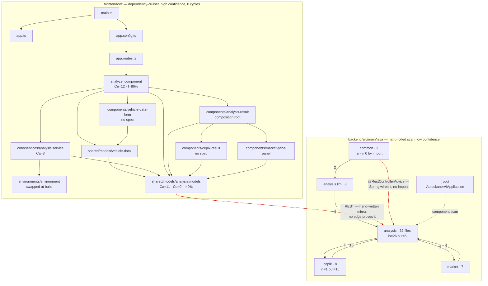

# Artifact 2 — Structure: what actually imports what

**Method.** Two tools of very different confidence, and the difference matters more than
any number below.

| Layer | Tool | Confidence | What it sees |
|---|---|---|---|
| `frontend/src` | `dependency-cruiser` 18.2.0, config at `frontend/.dependency-cruiser.cjs` | **high** — a real resolver, `tsPreCompilationDeps: true` | `import`/`export` in TS and JS |
| `backend/src/main/java` | a hand-rolled 40-line import scanner (not committed) | **low** — regex over `^import com.example.autoskaner_ai.…` | explicit imports only |

Neither tool sees Angular HTML templates, Spring dependency injection by type, or the
REST boundary between the two stacks. **Where a tool shows no edge, the answer is
`unknown`, not "no coupling"** — and §1's first observation is a measured case of exactly
that, so this is not a disclaimer, it is a finding.

Read alongside `artifact-1-territory.md`, which says where work *happened*. This one says
what the code *is*.

---

## 1. The five observations worth the read

**1. The import graph's most confident "no coupling" is its biggest lie.** The `common`
package has **fan-in 0** — nothing in the repo imports it. It is also on the response path
of every single API call: `GlobalExceptionHandler` is a `@RestControllerAdvice`, `CorsConfig`
is a `@Configuration`, and `ErrorResponse` is the shape every failure comes back in. Spring
wires all three by annotation at runtime, so no `import` exists to record it. Artifact 1
independently measured `be:analysis` + `be:common` co-changing **6 times at 86% confidence**
and `be:common` + `ctx:changes` at **100%**. The git history is right and the import graph is
wrong. If you take one habit from this artifact: in a Spring codebase, fan-in 0 means
"look harder", never "safe to move".

**2. The two backend package cycles are one mistake, made twice.** `analysis ↔ cepik` and
`analysis ↔ market` are both real, and both have the same single cause: **the enrichment
integrations' own domain types were filed in `analysis`.** `CepikResult`, `CepikStatus`,
`DamageRecord`, `MileageStamp`, `VehicleEvent` and `MarketPriceContext` all live in
`analysis/`, while `MarketPriceStatus` and `MarketPriceSampleQuality` — the same kind of
thing — live in `market/`. So `cepik` reaches back into `analysis` 16 times for records it
owns conceptually, and `analysis/MarketPriceContext.java` reaches into `market` for the two
enums that type its own fields. There is **no file-level cycle**, only package-level: no
single class knot, just types in the wrong rooms.

**3. `analysis` is not a package, it is the backend.** 32 of 59 main Java files (**54%**),
fan-in 26 against fan-out 5. It holds the controller, the response records, the risk
adjuster, *and* both integrations' result types. Every other package points at it. This is
the structural reading of Artifact 1's "`backend:analysis` is the centre of gravity, hot in
both eras" — the area is busy because everything has to go through it.

**4. The frontend has zero cycles and one genuinely stable core.** 34 modules, 67
dependencies, no cycles at all. `src/app/shared/models` is **Ca=11, Ce=0, I=0%** — the
maximally stable node, imported by 6 of the 10 other production TS files under `src/app` and
importing nothing. That is the right shape for a foundation module, and it is also why it is
dangerous: it is the hand-written mirror of the Java records, so a wrong edit there reaches
everything, and no compiler on either side will object. **It is not type-only, despite the
folder name** — `vehicle-data.ts` exports 8 functions, including the VIN validation
(`vinError`, `normaliseVin`) and the request builder (`draftToRequest`). So the most-depended-on
folder in the app contains behaviour, and Ca=11 applies to that behaviour too. Found while
writing Artifact 3; see its §6.

**5. My own layering rule was wrong, and the violation is the finding.** `dependency-cruiser`
reports 2 errors for `panels-do-not-import-each-other`: `analysis-result` imports
`cepik-result` and `market-price-panel`. The rule assumed `components/` is a flat bag of
leaves. It is not — the real hierarchy is two levels deep, `analyzer` → `analysis-result` →
{`cepik-result`, `market-price-panel`}, and `analysis-result` is a **composition root**, not
a sibling. This is the structural explanation of Artifact 1's highest-lift co-change pair
(`fe:analysis-result` + `fe:features`, **×6.3**). The rule is left in place unchanged and
failing, because a violation that teaches the reader the hierarchy is worth more than a
green run — see §6 for how to fix it when the shape is confirmed.

---

## 2. Findings by area

| Area | What the graph shows | Evidence | Why it matters when you change it | Link to Artifact 1 | Check next |
|---|---|---|---|---|---|
| `backend:common` | fan-in **0**, fan-out 2 (`GlobalExceptionHandler` → `analysis.llm` exceptions) | import scan; `@RestControllerAdvice` at `common/GlobalExceptionHandler.java:19`, 5 `@ExceptionHandler` methods | Change the error envelope and you change every endpoint's failure contract, with no import to warn you. The frontend has no compile-time link to it either | §4: `be:analysis`+`be:common` n=6 ×2.4 **86%**; `be:common`+`ctx:changes` n=7 **100%** | whether `AnalysisControllerTest` covers all 5 handler branches or only the LLM two |
| `backend:analysis` | 32/59 files (54%), fan-in 26 / fan-out 5 | import scan, package sizes | Almost any backend change lands here or points at it. Splitting it is the highest-leverage structural move available | §2: hottest code area, 33 commits, hot in **both** eras | which of the 32 files are *domain records* vs *behaviour* — that is the seam |
| `backend:cepik` | fan-out **16** / fan-in **1** | import scan; 16 imports across 5 files, all reaching into `analysis` | The single inbound edge is `AnalysisController` — which is also the only place that knows enrichment failure is survivable (`try`/`catch (RuntimeException)` at `analysis/AnalysisController.java:144-151`, "Enrichment degraded, analysis returned without it"). Call `enrich()` from anywhere else and `HistoriaPojazduSessionException` escapes raw | §2: heating up, 4→10 commits | that no future caller bypasses the controller's containment |
| `backend:market` | fan-in 4 / fan-out 6; the `analysis → market` edge is 2 of 4 imports from a *record* | import scan; `analysis/MarketPriceContext.java` imports `market.MarketPriceSampleQuality`, `market.MarketPriceStatus` | A record in one package typed by enums in another is the cycle in miniature. Moving `MarketPriceContext` into `market` removes half the cycle in one edit | §4: steady, 3→6 | whether `MarketPriceContext` has any caller outside `market` + the controller |
| `frontend:shared/models` | **Ca=11, Ce=0, I=0%** | dependency-cruiser metrics | The only module the whole app depends on and nothing constrains. No compiler checks it against the Java records | §4: `be:analysis`+`fe:shared` n=6 ×1.7 60%; the `88d2658` drift **already happened** | nothing — this is what `e2e/market-price-contract.spec.ts` exists for. Keep it |
| `frontend:analyzer.component` | Ca=2, **Ce=12** (5 first-party), **I=86%** | metrics | The most coupled module in the frontend and the hardest to instantiate in isolation. Every new panel widens it | §2: 9 touches, joint 5th-most-changed file | whether a new panel should hang off `analysis-result` instead |
| `frontend:analysis-result` | imports 2 sibling panels; Ca=2, Ce=8, I=80% | 2× `error panels-do-not-import-each-other` | It is a composition root, so it re-renders on any child's contract change. That is correct behaviour, mis-modelled by my rule | §4: `fe:analysis-result`+`fe:features` **×6.3**, the highest lift in the repo | confirm the intended depth, then split the rule (§6) |
| `frontend:environments` | `environment.prod.ts` reported an **orphan** | 1× `warn no-orphans` | **False positive with a production-sized cost.** It is wired by `fileReplacements` in `angular.json:61-66`, invisible to the tool. `environment.ts` has `apiUrl: ''`; `environment.prod.ts` has `apiUrl: 'https://autoskanerai.onrender.com'`. Delete it on the tool's advice and the Cloudflare frontend calls itself instead of Render | not in Artifact 1 — it has never been touched since the scaffold, so co-change said nothing | leave it; the warning stays as documentation of the blind spot |
| dead `RiskAnalysis*` | `RiskAnalysisController` is a live `@RestController`, referenced by nothing but its own request/response/test | `grep -rl @RestController` finds it; import scan gives it no inbound edge | Structurally confirms Artifact 1's "confirmed dead": it is reachable over HTTP but has no caller in the repo | §5, frozen since 2026-05-24/31 | nothing here — removal is M4-L4's call, not a mapping decision |

---

## 3. The graph

Graphviz is not installed on this machine, so the prompt's SVG render is substituted with
Mermaid, which the synthesis step wants anyway. First-party edges only; PrimeNG and Angular
packages omitted. **Dashed = a coupling no tool proved.**

Edge indices 24 and 25 are the red ones, and they are the whole point of this artifact:
**two of the couplings that matter most are couplings no tool drew.** The third dashed edge
(the component scan) is why `common` works at all despite a fan-in of zero.

---

## 4. Testability risks

### Summary

The frontend is straightforwardly testable and the numbers say why: no cycles, and a
zero-instability type core that any spec can import for free. The one genuinely awkward
module is `analyzer.component` at I=86% — it needs a service double plus two child
components before it renders. The backend's risk is not cycles either; it is that
**`analysis` at 54% of the files has no seam in it**, so a unit test of anything inside it
tends to become a test of the controller.

### Test risks

1. **`analysis.models.ts` (Ca=11, Ce=0) is the app's only shared contract and has no
   verifier on either side.** The backend suite asserts its own JSON; the frontend suite
   asserts against hand-written doubles; a field rename ships green. Already happened once
   (`88d2658`). *Mitigated, deliberately and minimally:* `e2e/market-price-contract.spec.ts`
   is the one Playwright spec, and it compares the DOM against the same response's own JSON.
   Structure now confirms the choice the risk map made.
2. **`common` cannot be unit-tested through an import, because nothing imports it.** Its five
   `@ExceptionHandler` branches are only reachable through a controller test. That makes the
   error envelope's coverage a function of `AnalysisControllerTest`'s thoroughness, not of a
   dedicated spec — and `AnalysisControllerTest` is the single most-edited test file in the
   repo (11 touches, Artifact 1 §2).
3. **`cepik-result.component` and `vehicle-data-form.component` have no spec.** Confirmed
   structurally: dependency-cruiser lists spec modules for `analysis-result`,
   `market-price-panel`, `analyzer` and `analysis.service`, and none for those two.
   **This does not mean untested** — checked while writing Artifact 3, and
   `analyzer.component.spec.ts` exercises the VIN and draft logic substantially through the
   component (malformed VIN blocks submission, VIN-only submission succeeds, input is trimmed
   and upper-cased, prefill leaves `vin` empty). The accurate finding is narrower: the 8 pure
   functions in `shared/models/vehicle-data.ts` are covered **only transitively**, so their
   coverage is coupled to the component's rendering, and a direct spec would be cheap. Note
   that this is the inference §7 warns about for orphans, made one section later.
4. **Enrichment failure containment lives in the caller, not the callee.** The only thing
   keeping a registry session failure from failing an entire analysis is a `catch
   (RuntimeException)` in `AnalysisController`. `cepik`'s fan-in of 1 is what makes that safe
   today, and a second caller is what would break it — silently, and only in production,
   since `MockCepikService` does not throw. This is the structural face of the business rule
   that absence of accident data means unknown.
5. **The package cycles do not break the build and will not break a test.** Java compiles
   cycles happily. Listing them as a *test* risk would be wrong; they are a comprehension
   and refactoring risk, which is where §6 puts them.

### Most suspicious modules

| Module | Why |
|---|---|
| `analysis/AnalysisController.java` | fan-out into both integrations, owns the resilience policy, 9 touches, and its test is the most-edited file in the repo. Everything meets here |
| `analysis/MarketPriceContext.java` | a record in `analysis` typed by enums in `market`; half of one cycle in a single file |
| `frontend/.../analyzer.component.ts` | I=86%, Ce=12; the only module that needs a mock plus two children to stand up |
| `frontend/.../vehicle-data-form.component.ts` | holds validation logic, has no spec, and is the newest component (era 2 only) |
| `common/GlobalExceptionHandler.java` | fan-in 0, reachable only via HTTP, defines every endpoint's failure shape |

### What to check next

- Whether `AnalysisControllerTest` reaches all five `@ExceptionHandler` branches or only the
  two LLM ones. If not, that is a real coverage hole hidden behind a fan-in of 0.
- Whether `MarketPriceContext` is referenced outside `market` + `AnalysisController`. If not,
  moving it is a one-commit fix to half the cycle problem.
- Which of `analysis`'s 32 files are records/enums with no behaviour. That count is the size
  of the shared-kernel package that does not exist yet.

---

## 5. Entry points

Worth stating plainly, because both tools are better at edges than at roots.

| Stack | Entry | Note |
|---|---|---|
| backend | `AutoskanerAiApplication` (root package, 1 file) | component-scans everything below it; the reason `common` works despite fan-in 0 |
| backend | `POST /api/analyses` → `analysis/AnalysisController` | the live endpoint |
| backend | `POST /api/analysis/risk` → `analysis/RiskAnalysisController` | **dead** — reachable over HTTP, no caller anywhere in the repo |
| backend | `common/GlobalExceptionHandler` | a second entry in effect: every uncaught throw arrives here |
| frontend | `src/main.ts` → `app.ts` + `app.config.ts` → `app.routes.ts` → `analyzer.component` | one route, one feature |
| frontend | `src/environments/environment.ts` | swapped for `.prod.ts` by `angular.json` at build time — an entry point no import graph can see |

---

## 6. What was *not* changed, and why

- **`panels-do-not-import-each-other` stays as-is, failing with 2 errors.** The honest fix is
  to encode the real two-level hierarchy: allow `analysis-result` → any sibling panel, forbid
  every other lateral edge. That is a five-line rule change, and it is deliberately not made
  here — this artifact's job is to record that the map and the territory disagreed, and a rule
  quietly rewritten to match the code teaches nobody anything. Fix it in M4-L4 or the first
  time a third panel is added.
- **`no-orphans` keeps warning about `environment.prod.ts`.** Suppressing it would delete the
  only written record that `fileReplacements` exists and that the tool is blind to it.
- **The package cycles are named, not fixed.** Moving `CepikResult`, `CepikStatus`,
  `DamageRecord`, `MileageStamp`, `VehicleEvent` into `cepik` and `MarketPriceContext` into
  `market` would remove both cycles except for `ExtractedData`, which is genuinely
  analysis-owned input. That is a refactoring decision with a blast radius across 235 tests —
  M4-L4's territory, not mapping's.
- **`dependency-cruiser` was installed under `frontend/`, not at the repo root.** Root
  `CLAUDE.md` is explicit that a new root `package.json` is an unverifiable risk to the
  Cloudflare Pages build path, and pre-push on `main` runs the production build, so this
  choice gets checked rather than assumed. `npm audit`'s 1 moderate (`qs`) is **pre-existing** —
  traced to `@angular/cli` → `@modelcontextprotocol/sdk` → `express`, and `node_modules/qs`
  is already in `git show HEAD:frontend/package-lock.json`.

---

## 7. Limits — what this artifact does NOT tell you

1. **The backend numbers are low-confidence.** A regex over `import` lines. It misses
   reflection, `@Autowired` by type, `@Value`, anything constructed by Spring, and anything
   referenced by fully-qualified name. It also counts one wildcard
   (`import com.example.autoskaner_ai.analysis.*` in `AnalysisResponseParser`) as a single
   edge when it may stand for several. Package sizes and fan-in/out **ranks** are trustworthy;
   edge weights are indicative only. Confirm anything load-bearing with a grep, the way §1's
   observation 2 was confirmed.
2. **Angular HTML templates are invisible to both tools.** A component used only in a
   `.html` file shows as an orphan. Nothing here was deleted on orphan evidence, and nothing
   should be.
3. **Spring DI is invisible.** See observation 1. This is the single largest gap in the
   artifact, and it is a gap in the *tooling*, not in the code.
4. **The REST boundary is not in either graph.** `analysis.models.ts` ↔ the Java records is
   the tightest coupling in the repo and has zero edges describing it.
5. **Test sources were only partly scanned.** `dependency-cruiser` was pointed at
   `frontend/src`, which includes the 4 spec files; the Java scan covered
   `src/main/java` only, so the 25 backend test classes and their coupling are absent.
6. **No runtime evidence at all.** Nothing here reflects call frequency, latency, or which
   branches actually execute. The ~27 s request and the ~11 s enrichment tail are documented
   facts from `CLAUDE.md`, not measurements from this artifact.
7. **`context/archive/` and generated output** (`dist/`, `target/`) were excluded, as in
   Artifact 1.
