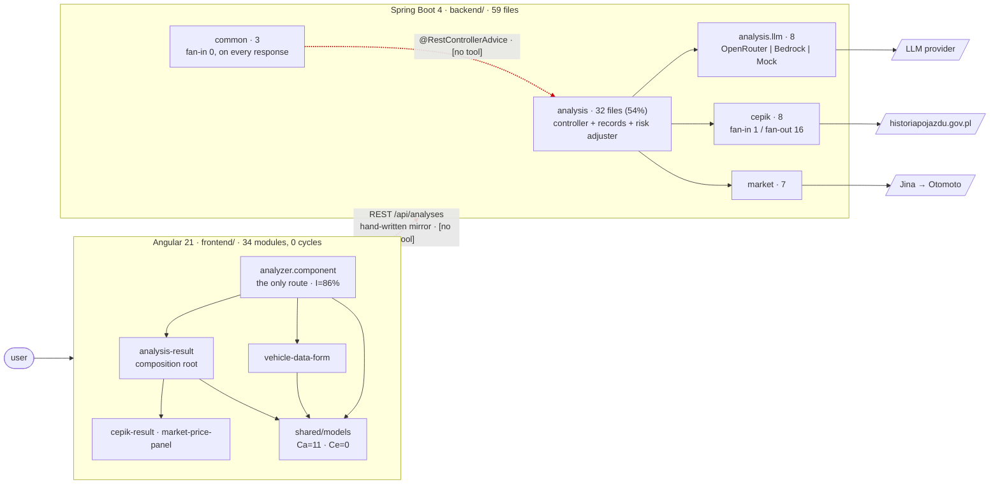

# Repo map — AutoSkanerAI

**Read this first. 15 minutes.** It synthesises three evidence artifacts and does not repeat
their tables; follow the pointers when you need the numbers.

| Artifact | Answers | Method / confidence |
|---|---|---|
| [`artifact-1-territory.md`](artifact-1-territory.md) | where work happened | git history, 96 commits — high |
| [`artifact-2-structure.md`](artifact-2-structure.md) | what imports what | dependency-cruiser (frontend, **high**) + a hand-rolled Java import scan (**low**) |
| [`artifact-3-contributors.md`](artifact-3-contributors.md) | who to ask | git authorship — high, but see §7 |

Every coupling below is tagged with how it is known: **[imports]**, **[git]**, or
**[no tool]** — the last meaning no dependency graph covers that layer at all. **[no tool]
is `unknown`, never "no coupling"**, and §3 opens with the case that proves it.

---

## 1. TL;DR

AutoSkanerAI analyses Polish used-car listings: a Spring Boot 4 backend (Java 21, 59 main
files, 6 packages) pulls the advert text, sends it to an LLM, enriches the result from the
vehicle registry and a market-price sample, and an Angular 21 frontend (34 modules, one
route, one feature) renders it. Work concentrates almost entirely in one backend package —
`analysis` is 32 of 59 files and was the hottest area in both bursts of development. The
frontend is structurally clean: zero import cycles and a genuinely stable foundation module.
Where it hurts is the seams: the REST contract between the two stacks is a **hand-written
mirror with no compiler and no tool edge on either side**, and it has already drifted once in
production-bound code. The project has one human contributor and 81% of commits are
agent-co-authored, so its institutional memory lives in `context/changes/` — the busiest area
in the whole repo. The single most useful fact for a newcomer is a date: **the project sat
dormant for 84 days, and anything written before 2026-08-25 is a claim, not a verified fact.**

---

## 2. Terrain

**Big responsibility.** `backend:analysis` — the live endpoint, the response records, the
risk adjuster, *and* both integrations' result types. 30 commits, hot in both eras, fan-in 26
against fan-out 5 **[imports]**. Almost any backend change lands here or points at it.

**Periphery.** `frontend:core` (one service, 3 commits), `analysis.llm`'s Bedrock provider
(frozen 3 months, **cannot run in production by design** — the only AWS credential is a
short-lived corporate SSO profile), and the `RiskAnalysis*` facade: 4 files serving a live
HTTP endpoint that **nothing in the repo calls** — confirmed dead by both git and imports.

**Deep modules** — small interface, a lot hidden behind it, and the good news in this repo.
`cepik` hides session scraping and HTML parsing of a government site behind one interface and
has **fan-in 1** **[imports]**. `market` and `analysis.llm` are the same shape. All three
follow one pattern: an interface, a `@Profile("mock")` bean, a real bean. A fourth
integration should be added the same way.

**Shallow / sprawling.** `analysis` is not really a module — it is a package with four jobs
and no interface. `cepik-result.component` passes models straight to its template.

**Activity in time.** Two bursts, **12 active days across 15 calendar weeks**, split by an
84-day gap. Era 1 (2026-05-24 → 06-02) built it; Era 2 (2026-08-25 → 09-04) discovered it had
never run against a real provider and spent itself verifying. Era 2 found four Era-1
explanations to be wrong: invented CEPiK field names, a median that was the upper-middle
element, a formatter hook dead since May, and `SPRING_PROFILES_ACTIVE=mock` pinned in
production. Hence the dating rule in §1.

### Where the directory tree lies to you

The most useful thing a map can do. Six cases, all measured:

| On disk it looks like | It actually is | Evidence |
|---|---|---|
| `analysis/` — one concern | four: HTTP, domain records, `cepik`'s records, `market`'s records | **[imports]** 54% of files, both cycles originate here |
| `common/` — a leaf nobody uses, **fan-in 0** | on the response path of **every** API call, via `@RestControllerAdvice` | **[no tool]** + **[git]** 86% co-change with `analysis` |
| `components/` — a flat bag of panels | two levels deep; `analysis-result` is a composition root | **[imports]** 2 rule violations, left failing on purpose |
| `shared/models/` — types | also 8 functions, incl. the VIN validation | **[imports]** |
| `environment.prod.ts` — an orphan, safe to delete | production's API URL, swapped in by `angular.json:61-66` | **[no tool]** — delete it and Cloudflare calls itself instead of Render |
| `context/changes/` — docs | **58 commits, 60% of all of them** — the busiest area in the repo | **[git]** |

---

## 3. Real couplings

**Start with the one that has no edge anywhere.** `common` has fan-in 0 in the import graph —
nothing imports it. It is also on every response path, because Spring wires
`GlobalExceptionHandler`, `CorsConfig` and `ErrorResponse` by annotation. Git history
measured that same coupling at **86% confidence** with `analysis` and **100%** with
`context/changes/`. The history is right and the graph is wrong. In this codebase, fan-in 0
means *look harder*.

The couplings worth knowing, in order of what a change to them costs:

1. **`frontend/shared/models/analysis.models.ts` ↔ the Java records — [no tool].** The
   tightest coupling in the repo and the only one with zero edges describing it. Hand-written
   mirror, no compiler on either side, backend tests assert their own JSON, frontend tests
   assert against hand-written doubles — so a field rename ships green with a blank panel.
   **[git]** confirms it is maintained deliberately (6 of 9 model-file commits also touched
   `backend/src/main/java`) and that it has **already drifted once**: `88d2658` edited the
   TypeScript side alone, in a commit whose message calls it a fix.
2. **Two backend package cycles — [imports, low confidence, grep-verified].**
   `analysis ↔ cepik` and `analysis ↔ market`. One mistake made twice: both integrations'
   domain records were filed in `analysis` (`CepikResult`, `CepikStatus`, `DamageRecord`,
   `MileageStamp`, `VehicleEvent`, `MarketPriceContext`) while `market`'s status enums were
   not — so `analysis/MarketPriceContext.java` reaches into `market` for the enums typing its
   own fields. **No file-level cycle**: types in the wrong rooms, not a class knot. Java
   compiles it happily; it costs comprehension, not correctness.
3. **`analysis-result` ↔ its host — [imports] + [git].** The highest-lift co-change pair in
   the repo (**×6.3**) and the import graph explains why: it is a composition root, so any
   child's contract change re-renders it.
4. **Enrichment failure containment lives in the caller — [imports].** A registry session
   failure is survivable only because of a `catch (RuntimeException)` in
   `AnalysisController.java:144-151`. `cepik`'s fan-in of 1 is what makes that safe; a second
   caller would break it silently, and only in production, since the mock never throws.
5. **`common` ↔ `context/changes/` at 100% — [git].** The error shape was never changed
   without a change doc. Process as coupling, and it worked.

### Regenerated, mocked, or hand-edited?

The lesson asks that these be weighed differently, because a coupling maintained by
regeneration is cheap and one maintained by hand is not. Here:

- **No regeneration coupling exists.** There is no codegen in the repo — no OpenAPI
  generator, no schema-to-TS pipeline, no snapshot fixtures. **Every** co-change listed above
  cost someone an edit, so read all of them at full price.
- **Mock coupling exists and is unusually expensive.** Three `@Profile("mock")` beans stand in
  for the LLM, the registry and the market fetch. `MockMarketPriceEnrichmentService` ignores
  its input and is safely constant — but `MockAiAnalysisService` is **content-sensitive**: one
  word of listing text moved `overall` from 41 to 35. It is the E2E oracle, so a change to it
  silently changes what the only Playwright spec means. That inverts the usual rule: this mock
  is *more* expensive to touch than the production code it stands in for, which is why the
  contract spec deliberately asserts no scores.
- **Fixtures change only by capture, never by edit** — `backend/src/test/resources/cepik/*.json`
  must be verbatim payloads. That rule is what made the invented-field-name defect findable.

---

## 4. Risk zones

| Zone | Why | Where |
|---|---|---|
| **the REST contract** | tightest coupling in the repo, no compiler, no graph edge, drift already shipped once | `shared/models/analysis.models.ts` ↔ `analysis/*.java` |
| **`analysis` as a package** | 54% of the backend with no seam, both cycles, and the resilience policy buried in a private helper | `backend/.../analysis/` |
| **`cepik`** | behaviour defined by a government site nobody controls; 100% agent-authored with zero solo commits; Era 2 found its field names invented | `backend/.../cepik/` |
| **`common`** | defines every endpoint's failure contract, reachable only over HTTP, fan-in 0 so nothing warns you | `common/GlobalExceptionHandler.java` |
| **the mock oracle** | the E2E spec's meaning depends on a mock's prose | `analysis/MockAiAnalysisService.java` |
| **`vehicle-data-form` + `vehicle-data.ts`** | holds the VIN and mileage rules, is the newest code, and is the only shipped feature with no plan, research or review record | `frontend/.../vehicle-data-form/`, `shared/models/vehicle-data.ts` |

And one business invariant that outranks all of them: **absence of accident data means
unknown, not clean.** Never present missing data as confirmation of clean history — in LLM
prompts, API responses, or UI copy. It is enforced in `AnalysisResponseParser` and it is the
one rule no artifact derived; it was given.

---

## 5. Who to ask

There is **one human contributor**, author and committer of all 96 commits, and no bots. So
the honest per-zone answer is not a name — it is the artifact that stands in for the person.
See [`artifact-3-contributors.md`](artifact-3-contributors.md) §5 for the full reasoning.

| Zone | Ask | Second choice |
|---|---|---|
| the REST contract | `frontend/e2e/market-price-contract.spec.ts` — an **executable** witness, the best substitute here because it fails when the answer changes | `frontend/CLAUDE.md` § "E2E: one spec, on purpose" |
| `analysis` | `context/changes/s-01/` and `llm-analysis-wiring/` — full chains: brief → plan → review → change | `AnalysisControllerTest` (the most-edited file in the repo, 11 touches) |
| `cepik` | the **verbatim fixtures** under `backend/src/test/resources/cepik/` — the fixture *is* the documentation of the API | `context/archive/2026-06-02-cepik-vin-lookup/` |
| `common` | `context/changes/ab-experiment-error-shape.md` | `backend/CLAUDE.md` § "API error shape" |
| the mock oracle | `context/foundation/test-plan.md` §7 | `frontend/e2e/E2E-RULES.md` |
| `vehicle-data-form` | **nothing in the change chain — this is the one gap.** `frontend/CLAUDE.md` § "Vehicle data form" has the decisions but not the alternatives | ask the human |
| product intent, infra, credentials | **ask the human.** Business rules, the Render/Cloudflare wiring, the SSO and Zscaler constraints exist only outside the repo | — |

One provenance rule that replaces asking: **the reliable signal is the date, not the author.**
Every agent identity maps exactly onto one era — 4.x models to Era 1, Opus 5 to Era 2, with no
overlapping day — so "which agent wrote this" and "was this verified against a real provider"
are the same question. Do not read commit trailers as an audit trail; they are a convention
and were omitted on substantial commits, including S-02's 1,351 insertions.

---

## 6. First day — read these eight, in this order

~1,300 lines total. Enough to change something safely.

| # | File | ~lines | Why here |
|---|---|---|---|
| 1 | `CLAUDE.md` | 158 | the rules, the gates, the map. It loads **additively** with `backend/CLAUDE.md` and `frontend/CLAUDE.md` — read the child for whichever stack you are touching |
| 2 | `frontend/src/app/shared/models/analysis.models.ts` | 177 | the whole contract in one file, and the repo's highest-risk coupling. Read it as the API spec it really is |
| 3 | `backend/.../analysis/AnalysisController.java` | 164 | the one live endpoint. Orchestration order, and the enrichment containment at :144 |
| 4 | `backend/.../analysis/llm/AnalysisResponseParser.java` | 250 | where the business invariant is enforced — absence means unknown |
| 5 | `backend/.../analysis/CepikRiskAdjuster.java` | 254 | how registry findings fold into the score. The only place two data sources meet |
| 6 | `frontend/.../analyzer/analyzer.component.ts` | 194 | the entire UI state machine. Most coupled module in the frontend (I=86%) |
| 7 | `frontend/e2e/market-price-contract.spec.ts` | 95 | the only Playwright spec, and the model for why a test exists here at all |
| 8 | `context/changes/s-01/change.md` | 19 | short, and it teaches the process: how this project records a decision, which is how you will find every other answer |

Then, before your first change: `git config core.hooksPath .githooks` — the hooks are
versioned but git will not pick them up on its own, and **there is no CI**. `main`
auto-deploys to both hosts, so pre-push is the last gate before production.

---

## 7. Limits — what this map does NOT tell you

1. **The window is the whole history, not a year of steady work.** 96 commits over 12 active
   days in 15 weeks. Ranks are meaningful; magnitudes are not. One busy afternoon creates a
   hot spot.
2. **Half the structural evidence is low-confidence.** The frontend graph comes from a real
   resolver. The backend numbers come from a regex over `import` lines that cannot see
   reflection, Spring DI by type, or fully-qualified references. Package sizes and fan-in/out
   *ranks* are trustworthy; edge weights are indicative. Confirm anything load-bearing with a
   grep.
3. **Three layers have no dependency graph at all — `unknown`, not "no coupling":** Angular
   HTML templates, Spring dependency injection, and the REST boundary between the stacks.
   That last one is the tightest coupling in the repo. Nothing was deleted on orphan evidence
   and nothing should be.
4. **Commit counts measure attention, not quality.** `analysis` is hot because it is where the
   product lives *and* where the bugs were. Nothing here separates those.
5. **No runtime evidence.** No call frequency, latency, or branch coverage. The ~27 s request
   and ~11 s enrichment tail are documented facts, not measurements from this map.
6. **No bus-factor signal.** One human, 15 weeks, nobody has left or forgotten anything yet.
7. **Backend test sources were not scanned structurally** — 25 test classes and their coupling
   are absent from §3.
8. **This map does not fix what it maps.** The two cycles, the failing lint rule, the missing
   S-02 change doc and the dead `RiskAnalysis*` facade are all named and all left alone. They
   are refactoring decisions with a blast radius across 235 backend tests.
